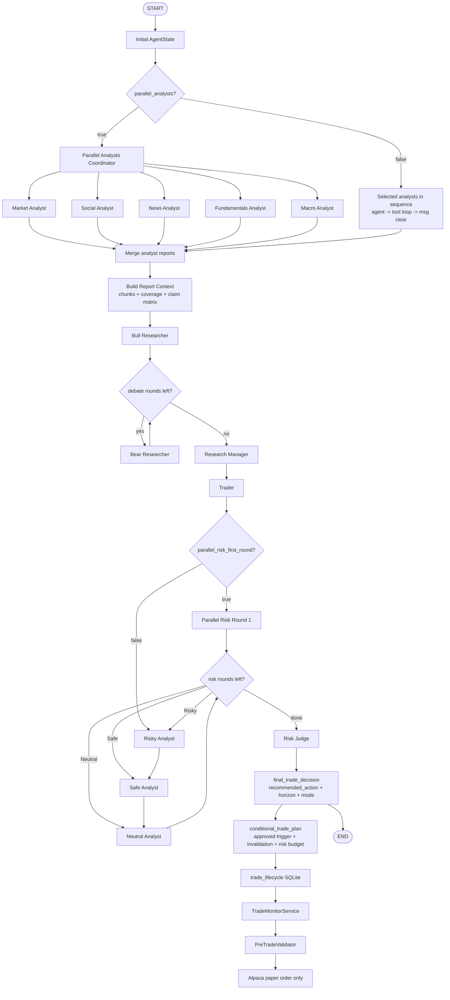
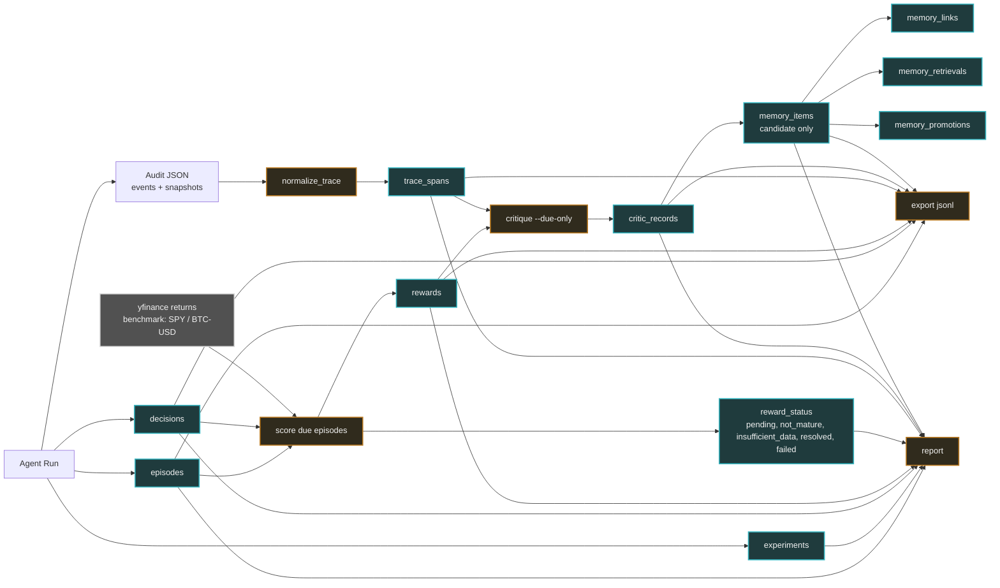

# Architecture Mermaid Source

The original `assets/schema.png` describes the early TradingAgents pipeline.
The current system has moved beyond that static picture: it now has multiple
entry points, provider-agnostic model selection, deterministic technical
briefs, compressed report context, durable run audit logs, an Episode Ledger,
reward resolution, trace normalization, critic records, and governed memory
candidates. Alpaca execution is now an optional adapter, not the center of the
architecture.

This document keeps a Mermaid source view of the current architecture. It is
not intended to be pixel-identical to the PNG; it is intended to be accurate
and maintainable.

For the complementary information architecture used by AI agents and LLMs to
find historical runs, summaries, evidence spans, memory, and retrieval packs,
see [Agent/LLM-Friendly Architecture](agent-llm-friendly-architecture.md).

## System View

```mermaid
%%{init: {
  "theme": "base",
  "themeVariables": {
    "background": "#151515",
    "mainBkg": "#151515",
    "primaryTextColor": "#f2f2f2",
    "lineColor": "#ededed",
    "fontFamily": "Inter, ui-sans-serif, system-ui, sans-serif"
  },
  "flowchart": {
    "curve": "basis",
    "htmlLabels": true
  }
}}%%
flowchart LR
  subgraph Entry["ENTRY POINTS"]
    direction TB
    WebUI["Dash Web UI<br/>run_webui_dash.py"]:::entry
    CLI["Interactive CLI<br/>cli.main"]:::entry
    EvalCLI["Eval CLI<br/>collect, score, critique, report, export"]:::eval
  end

  subgraph Runtime["RUNTIME CONFIG & MODELS"]
    direction TB
    RuntimeConfig["Run Config<br/>models, horizon, analysts, tools, leakage policy"]:::config
    LLMRouter["Provider-Agnostic LLM Router<br/>normalizes model params and clients"]:::config
    QuickLLM["Quick LLM Role<br/>analysts + debate agents"]:::llm
    DeepLLM["Deep LLM Role<br/>synthesis + final judgment"]:::llm

    RuntimeConfig --> LLMRouter
    LLMRouter --> QuickLLM
    LLMRouter --> DeepLLM
  end

  subgraph Graph["LANGGRAPH ORCHESTRATION"]
    direction TB
    TAGraph["TradingAgentsGraph"]:::graphNode
    InitialState["Initial AgentState"]:::state
    ParallelAnalysts["Selected Analysts<br/>parallel by default"]:::graphNode
    ReportContext["Report Context Builder<br/>compresses reports for downstream agents"]:::context
    ResearchDebate["Bull/Bear Debate<br/>max_debate_rounds"]:::agent
    ResearchManager["Research Manager<br/>structured schema fallback"]:::agent
    Trader["Trader<br/>proposal + live position context"]:::agent
    RiskRoundOne["Parallel Risk Round 1<br/>optional"]:::agent
    RiskDebate["Risk Debate<br/>Risky/Safe/Neutral loop"]:::agent
    RiskJudge["Risk Judge<br/>final decision"]:::agent
    FinalDecision["Final Decision<br/>text + structured conditional plan"]:::decision

    TAGraph --> InitialState --> ParallelAnalysts --> ReportContext
    ReportContext --> ResearchDebate --> ResearchManager --> Trader
    Trader --> RiskRoundOne --> RiskDebate --> RiskJudge --> FinalDecision
    Trader -. "parallel_risk_first_round=False" .-> RiskDebate
  end

  subgraph Agents["ANALYST TOOLING"]
    direction TB
    Market["Market Analyst"]:::agent
    News["News Analyst"]:::agent
    Social["Social Analyst"]:::agent
    Fundamentals["Fundamentals Analyst"]:::agent
    Macro["Macro Analyst"]:::agent
  end

  subgraph Data["DATA & TOOL LAYER"]
    direction TB
    TechnicalData["Market Data + Deterministic TA<br/>Alpaca/yfinance, Stockstats, Technical/Trend Briefs"]:::data
    NewsSocialData["News & Social Evidence<br/>Google News, Finnhub, Reddit, CoinDesk, OpenAI web search"]:::data
    FundamentalsData["Fundamental Evidence<br/>Finnhub, SimFin, DeFi Llama, web search"]:::data
    MacroData["Macro Evidence<br/>FRED, yield curve, macro web search"]:::data
    ToolGovernance["Tool Governance<br/>timeouts, quality checks, semantic retry, offline mode"]:::data
  end

  subgraph Memory["MEMORY & CONTEXT"]
    direction TB
    PromptContext["Prompt Context Layer<br/>claim matrix, retrieved excerpts, debate digest"]:::context
    LegacyMemory["Legacy Runtime Memory<br/>Chroma role memory + TradingMemoryLog"]:::memory
    GovernedMemory["Governed Memory Candidates<br/>evidence-linked, not auto-injected"]:::eval
  end

  subgraph Observability["OBSERVABILITY & EVALUATION FOUNDATION"]
    direction TB
    RunAudit["Run Audit JSON<br/>raw trajectory artifact"]:::audit
    Ledger["Episode Ledger<br/>canonical SQLite index"]:::eval
    StructuredRecords["Structured Records<br/>decisions, trace spans, experiments"]:::eval
    Rewards["Reward Store<br/>maturity + directional-alpha scoring"]:::eval
    Critic["Critic Layer<br/>diagnosis and memory candidates"]:::eval
    Reports["Reports / JSONL Export<br/>offline learning dataset"]:::eval
  end

  subgraph TradeLifecycle["TRADE LIFECYCLE"]
    direction TB
    ConditionalPlan["ConditionalTradePlan<br/>trigger + invalidation + risk budget"]:::exec
    TradeLifecycleDB["Trade Lifecycle SQLite<br/>plans, events, validations"]:::exec
    TradeMonitor["TradeMonitorService<br/>poll active plans"]:::exec
    PreTradeValidator["PreTradeValidator<br/>paper-only risk check"]:::exec
    AlpacaOrders["Alpaca Orders<br/>paper execution only"]:::exec
    AccountPanel["Positions / Orders UI<br/>account review"]:::exec
  end

  WebUI --> RuntimeConfig
  CLI --> RuntimeConfig
  RuntimeConfig --> TAGraph
  QuickLLM --> ParallelAnalysts
  QuickLLM --> ResearchDebate
  QuickLLM --> RiskDebate
  DeepLLM --> ResearchManager
  DeepLLM --> Trader
  DeepLLM --> RiskJudge

  ParallelAnalysts --> Market
  ParallelAnalysts --> News
  ParallelAnalysts --> Social
  ParallelAnalysts --> Fundamentals
  ParallelAnalysts --> Macro

  Market --> TechnicalData
  News --> NewsSocialData
  Social --> NewsSocialData
  Fundamentals --> FundamentalsData
  Macro --> MacroData
  TechnicalData --> ToolGovernance
  NewsSocialData --> ToolGovernance
  FundamentalsData --> ToolGovernance
  MacroData --> ToolGovernance
  ToolGovernance --> RunAudit

  ReportContext --> PromptContext
  PromptContext --> ResearchDebate
  PromptContext --> ResearchManager
  PromptContext --> Trader
  PromptContext --> RiskDebate
  LegacyMemory --> ResearchDebate
  LegacyMemory --> ResearchManager
  LegacyMemory --> Trader
  LegacyMemory --> RiskJudge

  TAGraph --> RunAudit
  ParallelAnalysts --> RunAudit
  ResearchDebate --> RunAudit
  ResearchManager --> RunAudit
  Trader --> RunAudit
  RiskDebate --> RunAudit
  RiskJudge --> RunAudit

  TAGraph --> Ledger
  FinalDecision --> StructuredRecords
  RunAudit --> StructuredRecords
  RuntimeConfig --> StructuredRecords
  Ledger --> StructuredRecords

  EvalCLI --> Ledger
  StructuredRecords --> Rewards
  Rewards --> Critic
  Critic --> GovernedMemory
  Ledger --> Reports
  Rewards --> Reports
  StructuredRecords --> Reports
  Critic --> Reports
  GovernedMemory --> Reports

  FinalDecision --> ConditionalPlan
  ConditionalPlan --> TradeLifecycleDB
  TradeLifecycleDB --> TradeMonitor
  TradeMonitor --> PreTradeValidator
  PreTradeValidator --> AlpacaOrders
  AlpacaOrders --> AccountPanel

  classDef entry fill:#24324a,stroke:#5f8fd3,stroke-width:2px,color:#f2f2f2;
  classDef config fill:#302b1d,stroke:#b97920,stroke-width:2px,color:#f2f2f2;
  classDef llm fill:#214573,stroke:#d9d9d9,stroke-width:2px,color:#f2f2f2;
  classDef graphNode fill:#1d2e38,stroke:#2f74c6,stroke-width:2px,color:#f2f2f2;
  classDef state fill:#353535,stroke:#d9d9d9,stroke-width:2px,color:#f2f2f2;
  classDef context fill:#314039,stroke:#33b99f,stroke-width:2px,color:#f2f2f2;
  classDef agent fill:#2f2b1f,stroke:#b97920,stroke-width:2px,color:#f2f2f2;
  classDef decision fill:#171717,stroke:#f2f2f2,stroke-width:2px,color:#f2f2f2;
  classDef data fill:#515151,stroke:#d9d9d9,stroke-width:2px,color:#f2f2f2;
  classDef memory fill:#2b3d2b,stroke:#78a76f,stroke-width:2px,color:#f2f2f2;
  classDef audit fill:#342c4a,stroke:#9b8be0,stroke-width:2px,color:#f2f2f2;
  classDef eval fill:#1f3b3d,stroke:#36b5c0,stroke-width:2px,color:#f2f2f2;
  classDef exec fill:#3a2730,stroke:#d06c8a,stroke-width:2px,color:#f2f2f2;
```

## Decision Graph Detail

## Evaluation-To-Learning Data Path

## Notes

- The old diagram hard-coded OpenAI o3 / GPT-4.1. The current runtime supports
  OpenAI, local OpenAI-compatible endpoints, Anthropic, Google, Azure, xAI,
  DeepSeek, Qwen, GLM, OpenRouter, and Ollama through `llm_clients`.
- The old diagram treated Alpaca as a central data and execution path. Today it
  is one data source plus an optional execution adapter; the primary product
  artifact is the auditable decision trajectory.
- Memory is split into legacy in-run reflection memory, the markdown
  `TradingMemoryLog`, and Phase 1.5 SQLite memory candidates. The Phase 1.5
  candidates are recorded for governance and reporting, not automatically
  injected into production prompts.
- Reward and critic records are evaluation infrastructure. They are not yet RL
  training or prompt self-modification.
